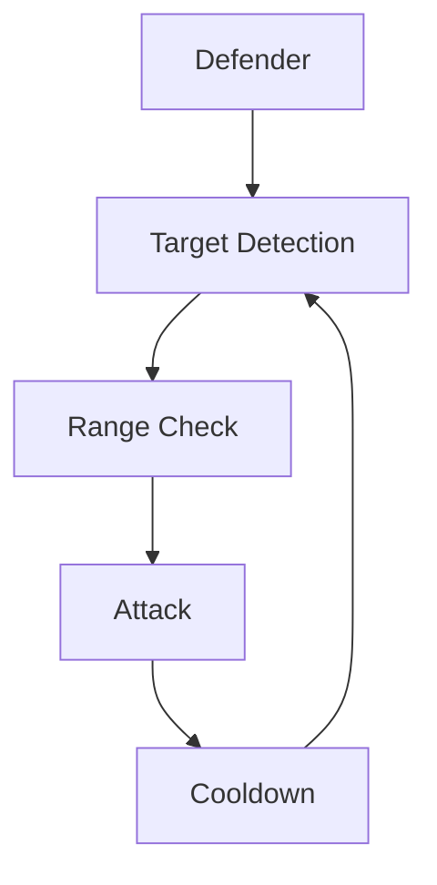
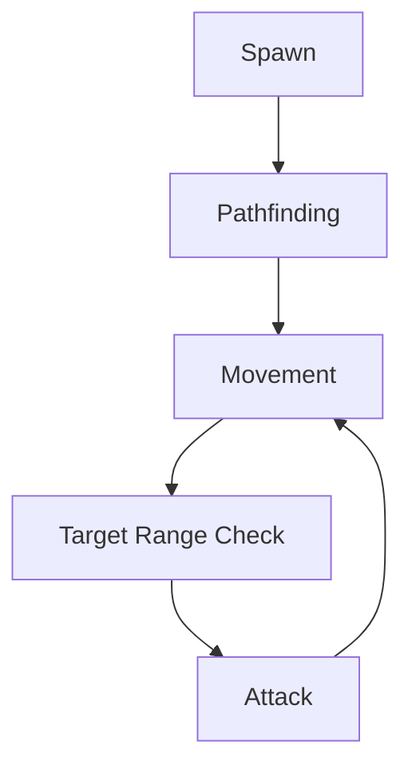
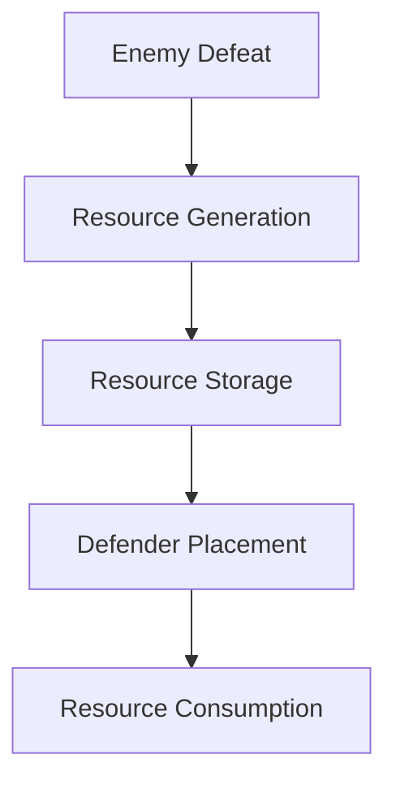
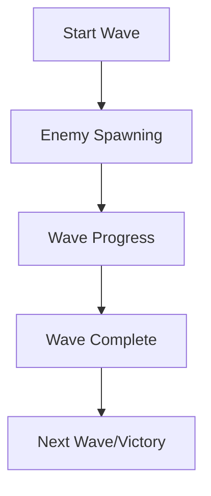

# System Patterns: Skyland Defenders

## Architecture Overview
The game follows a component-based architecture with distinct systems handling specific game mechanics.

## Core Systems

### Grid System
- Grid-based terrain representation
- Tile-based defender placement
- Collision detection for valid placement

### Combat System

### Enemy AI System

### Resource Management System

### Wave System

## System Interactions
- Grid system validates defender placement
- Combat system manages attacks and health
- Resource system gates defender placement
- Wave system controls game progression

## Technical Patterns
1. Observer pattern for game events
2. State machine for game flow
3. Component system for entities
4. Factory pattern for entity creation

## Development Guidelines
1. Keep systems modular and independent
2. Use events for cross-system communication
3. Implement clear interfaces between systems
4. Maintain single responsibility principle